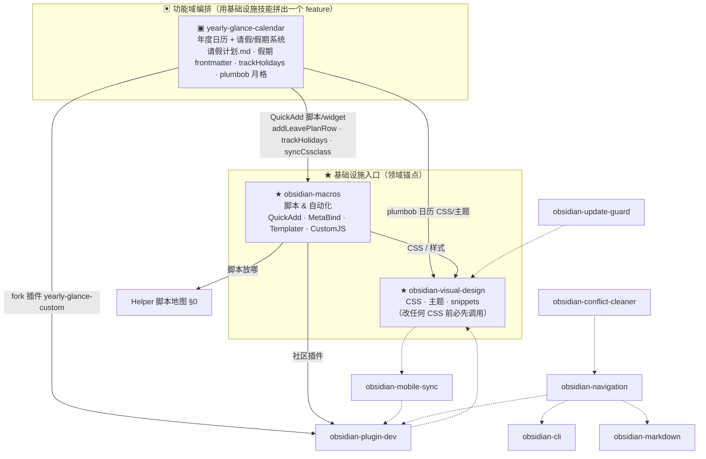

---
tags:
  - meta/index
created: 2026-06-11
modified_at: 2026-06-11
---

# Obsidian 技能编排关系（Claude Code skills）

> 本图描述的是 **Claude Code 里 `~/.claude/skills/obsidian-*` 技能之间**的调用/分流关系，不是 Helper 里的脚本。脚本放哪见 [[Helper 脚本地图]] §0。
> 现状：**两个基础设施锚点**（macros=脚本、visual-design=CSS）+ **功能域技能向下委派**（如 `yearly-glance-calendar` 拼用三者做出请假/日历 feature）；没有顶层 Obsidian router（不需要）。

## 怎么读

- **两个实线锚点** —— `obsidian-macros`（脚本/自动化）与 `obsidian-visual-design`（CSS）。只有这两个技能**声明**了自己是入口。
- **实线箭头** = 有意的分流路由（`macros` 在 2026-06-11 加的 hand-off）。
- **虚线箭头** = 各 SKILL 正文里既有的零散互相引用，是松散的网，不是真正的编排。
- **功能域技能（▣）= 上面一层**：`yearly-glance-calendar` 不是基础设施，而是一个**用基础设施拼出来的 feature**（请假/假期/日历）。它向下委派：脚本→`macros`、日历 CSS→`visual-design`、fork 插件→`plugin-dev`。深层状态见 memory `project_yearly_glance_leave_sync`。
- **没有顶层 Obsidian router**，这是对的：~10 个兄弟技能，两个基础设施锚点 + 功能技能各自向下委派，足够。

## 路由速查（用户请求 → 该用哪个技能）

| 请求 | 入口技能 |
|---|---|
| 年度日历 / 请假计划 / PTO·病假·公共假期 / 假期为什么不显示 / trackHolidays / plumbob 月格 / 编辑 yearly-glance-custom fork | `yearly-glance-calendar`（功能入口，会向下用 macros·visual-design·plugin-dev） |
| 加按钮 / QuickAdd 宏 / Meta Bind / 任何 vault 脚本自动化 | `obsidian-macros` |
| 改 CSS / snippet / 主题 / 视觉样式 | `obsidian-visual-design`（**改 CSS 前必先调用**） |
| 做 / fork / 部署一个社区插件 | `obsidian-plugin-dev` |
| 笔记导航组件 | `obsidian-navigation` |
| 插件更新安全 | `obsidian-update-guard` · 冲突文件 → `obsidian-conflict-cleaner` |
| `.obsidian` 配置 Mac↔iPhone 同步 | `obsidian-mobile-sync` |
| Bases / Markdown 语法 / CLI | `obsidian-bases` · `obsidian-markdown` · `obsidian-cli` |
| 新脚本放进哪个文件夹 | [[Helper 脚本地图]] §0 |
