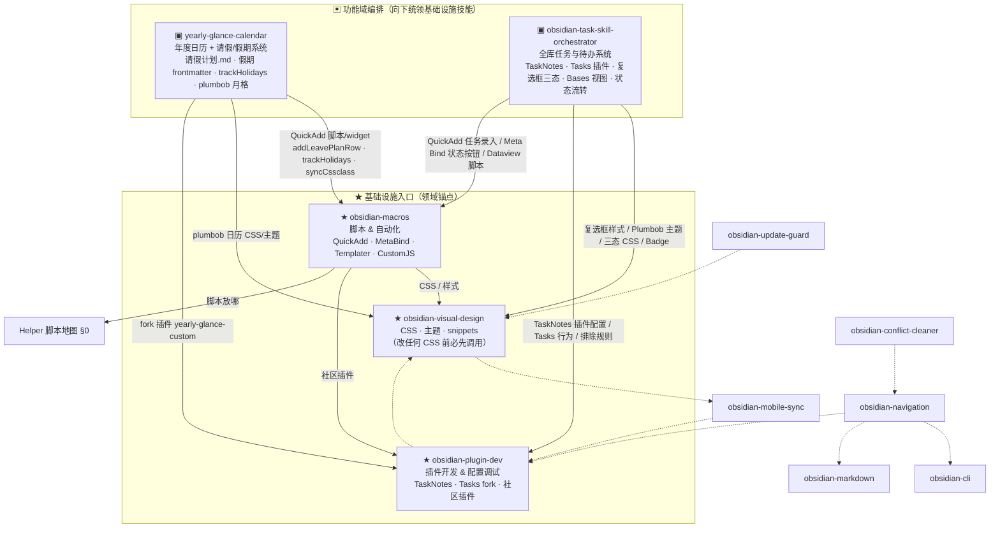

---
tags:
  - meta/index
created: 2026-06-11
modified_at: 2026-07-19
---

# Obsidian 技能编排关系（Claude Code skills）

> 本图描述的是 **Claude Code 里 `~/.claude/skills/obsidian-*` 与 hooks 编排器之间**的调用/分流关系，不是 Helper 里的脚本。脚本放哪见 [[Helper 脚本地图]] §0。
> 现状：**两大功能域编排器**（`yearly-glance-calendar`、`obsidian-task-skill-orchestrator`）向下统领与拼用**基础设施锚点技能**（`obsidian-macros`=脚本、`obsidian-visual-design`=CSS、`obsidian-plugin-dev`=插件）。

## 怎么读

- **功能域编排（▣）= 上层统领入口**：
  - `obsidian-task-skill-orchestrator`：统领全库任务相关的所有技能与边界约束（TaskNotes 架构、Pantry/结构化池隔离、Tasks 插件、复选框生命周期），向下编排 `visual-design`、`plugin-dev`、`macros`。
  - `yearly-glance-calendar`：年度日历、请假与假期系统，向下委派：脚本→`macros`、日历 CSS→`visual-design`、fork 插件→`plugin-dev`。
- **三大基础设施锚点（★）** —— `obsidian-macros`（脚本/自动化）、`obsidian-visual-design`（CSS/主题）、`obsidian-plugin-dev`（插件与配置）。
- **实线箭头** = 有意、声明式的分流路由与编排。
- **虚线箭头** = 各 SKILL 正文里既有的零散互相引用。

## 路由速查（用户请求 → 该用哪个技能）

| 请求 | 入口技能 |
|---|---|
| 任务管理 / TaskNotes / Tasks 插件 / 复选框生命周期 / 待办流转 / 任务看板与日历视图 | `obsidian-task-skill-orchestrator`（统领任务域，向下联动 visual-design·plugin-dev·macros） |
| 年度日历 / 请假计划 / PTO·病假·公共假期 / 假期为什么不显示 / trackHolidays / plumbob 月格 / 编辑 yearly-glance-custom fork | `yearly-glance-calendar`（功能入口，向下用 macros·visual-design·plugin-dev） |
| 加按钮 / QuickAdd 宏 / Meta Bind / 任何 vault 脚本自动化 | `obsidian-macros` |
| 改 CSS / snippet / 主题 / 视觉样式 | `obsidian-visual-design`（**改 CSS 前必先调用**） |
| 做 / fork / 部署一个社区插件 | `obsidian-plugin-dev` |
| 笔记导航组件 | `obsidian-navigation` |
| 插件更新安全 | `obsidian-update-guard` · 冲突文件 → `obsidian-conflict-cleaner` |
| `.obsidian` 配置 Mac↔iPhone 同步 | `obsidian-mobile-sync` |
| Bases / Markdown 语法 / CLI | `obsidian-bases` · `obsidian-markdown` · `obsidian-cli` |
| 新脚本放进哪个文件夹 | [[Helper 脚本地图]] §0 |

