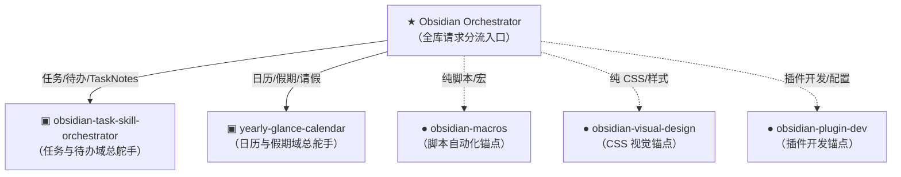
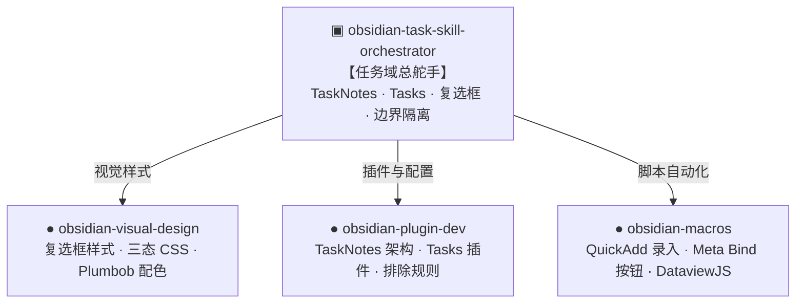
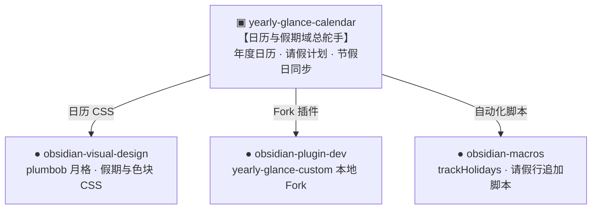

---
tags:
  - meta/index
created: 2026-06-11
modified_at: 2026-07-19
---

# Obsidian 技能编排体系（3-Tier Orchestration Hierarchy）

> 本图描述的是 **Claude Code 里 `~/.claude/skills/obsidian-*` 与 hooks 编排器之间**的完整 3 层分流与调用关系。脚本物理存放位置见 [[Helper 脚本地图]] §0。

### 1. 全库总分流体系 (Level 1 ➔ Level 2 / Level 3)

### 2. 任务与待办域编排 (Level 2 · Task Domain)

### 3. 日历与假期域编排 (Level 2 · Calendar Domain)

---

## 体系结构解析（3-Tier Architecture）

1. **Level 1 · Vault 总编排入口（Obsidian Orchestrator）**：
   - 面对全库级请求、重构或多模块联动时，判断具体业务领域，并将任务委派给对应的 **Level 2 垂直功能域编排器**。
2. **Level 2 · 垂直功能域编排器（Domain Orchestrators）**：
   - **`obsidian-task-skill-orchestrator`** (`hooks/obsidian-task-skill-orchestrator.mjs`)：统领全库任务系统规范（TaskNotes 结构、Pantry 排除边界、结构化同步池保护），协调底层的视觉样式、插件配置与脚本自动化。
   - **`yearly-glance-calendar`**：统领年度日历、请假计划与节假日同步业务规则。
3. **Level 3 · 基础设施底层技能（Infrastructure Anchors）**：
   - **`obsidian-visual-design`**（CSS/视觉）、**`obsidian-plugin-dev`**（插件开发/调试）、**`obsidian-macros`**（宏与脚本）。专注提供纯粹的技术实现能力，不负责业务边界裁决。

---

## 路由速查（用户请求 → 该用哪个技能）

| 请求类型 | 路由入口 / 编排器 | 协同调用的底层技能 |
|---|---|---|
| **全库总编排 / 跨模块重构** | `Obsidian Orchestrator` (Level 1) | 根据意图分流至 Level 2 或 Level 3 |
| **任务管理 / TaskNotes / Tasks 插件 / 复选框流转 / 看板日历视图** | `obsidian-task-skill-orchestrator` (Level 2) | `visual-design` + `plugin-dev` + `macros` |
| **年度日历 / 请假计划 / PTO·公共假期 / plumbob 月格 / yearly-glance fork** | `yearly-glance-calendar` (Level 2) | `macros` + `visual-design` + `plugin-dev` |
| **加按钮 / QuickAdd 宏 / Meta Bind / vault 脚本自动化** | `obsidian-macros` (Level 3) | 自身执行，样式委派 `visual-design` |
| **改 CSS / snippet / 主题 / 视觉样式** | `obsidian-visual-design` (Level 3) | 自身执行（**改 CSS 前必先调用**） |
| **做 / fork / 部署 / 调试社区插件** | `obsidian-plugin-dev` (Level 3) | 自身执行 |
| **笔记导航组件** | `obsidian-navigation` | `cli` · `markdown` · `plugin-dev` |
| **插件更新安全 / 冲突清理** | `obsidian-update-guard` · `obsidian-conflict-cleaner` | `visual-design` · `navigation` |
| **Mac ↔ iPhone 配置同步** | `obsidian-mobile-sync` | `plugin-dev` · `visual-design` |
| **Bases 语法 / Markdown 格式 / CLI 操作** | `obsidian-bases` · `obsidian-markdown` · `obsidian-cli` | 独立辅助技能 |
| **新脚本存放位置决策** | [[Helper 脚本地图]] §0 | 架构规范文档 |

